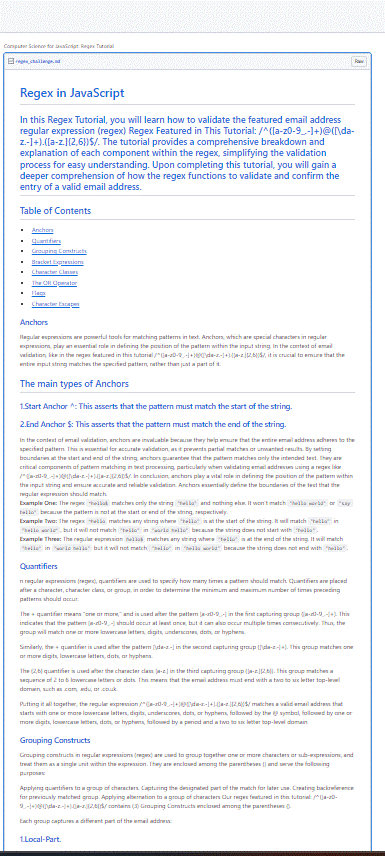

# Regex in JavaScript

## Description.
In this Regex Tutorial, you will learn how to validate the featured email address regular expression (regex) **Regex Featured in This Tutorial:** `/^([a-z0-9_\.-]+)@([\da-z\.-]+)\.([a-z\.]{2,6})$/`. The tutorial provides a comprehensive breakdown and explanation of each component within the regex, simplifying the validation process for easy understanding. Upon completing this tutorial, you will gain a deeper comprehension of how the regex functions to validate and confirm the entry of a valid email address.

## Table of Contents:
- [Overview](#Overview)
- [The Challenge](#The-Challenge)
- [Usage Information](#Usage-Information)
- [Installation Process](#Installation-Process)
- [Author](#Author)
- [Acknowledgments](#Acknowledgments)

 # Overview

## The Challenge
In this challenge, you will utilize the knowledge gained from the tutorial and apply it to the creation of a comprehensive tutorial on email validation using regex. The following steps were taken to achieve this:

1. Conducted a thorough literature review on the structure and format of email addresses.
2. Identified the necessary components that need to be validated in an email address, utilizing information from peer-reviewed sources.
3. Created a regex pattern that validates email addresses based on the identified components.
4. Set up a GitHub Gist, following the instructions provided in the "Installation Process" section.
5. In the newly created Gist, composed a brief explanation of the regex pattern created for email validation, describing each component and its purpose in the validation process. This explanation was informed by academic sources and tailored for novice coders and other academics.
6. Shared the link to the Gist with others to discuss different approaches and understanding of the regex pattern.

**The Sources Were Consulted:**
1. W3Resource. (n.d.). JavaScript: HTML Form - email validation. https://www.w3resource.com/javascript/form/email-validation.php
2.  Steipe, B. (n.d.). Regular expressions. University of Toronto: ABC: Always Be Coding. http://steipe.biochemistry.utoronto.ca/abc/index.php/Regular_Expressions

These sources provided valuable information on the construction and usage of regex patterns for email validation, as well as insights into the pedagogical aspects of teaching regex to new coders and other academics.


## Assigned User Story:
```
AS A web development student
I WANT a tutorial explaining a specific regex
SO THAT I can understand the search pattern the regex defines
```

## Acceptance Criteria:
```
GIVEN a regex tutorial
WHEN I open the tutorial
THEN I see a descriptive title and introductory paragraph explaining the purpose of the tutorial, a summary describing the regex featured in the tutorial, a table of contents linking to different sections that break down each component of the regex and explain what it does, and a section about the author with a link to the author’s GitHub profile
WHEN I click on the links in the table of contents
THEN I am taken to the corresponding sections of the tutorial
WHEN I read through each section of the tutorial
THEN I find a detailed explanation of what a specific component of the regex does
WHEN I reach the end of the tutorial
THEN I find a section about the author and a link to the author’s GitHub profile
```

**GitHub Gist: [Click Here](https://gist.github.com/Sunny9810/545576c3c8a04d4851a3fffd6b4c5b71)**
### The following animation demonstrates the GitHub Gist .md file:


## Usage Instructions:
1. Access the deployed GitHub Gist link.
2. Read through the introductory paragraph and summary.
3. Navigate through the table of contents to explore the different sections of the tutorial.
4. Read and understand each component of the regex pattern.
5. Apply the knowledge gained from the tutorial in your own projects.


## Deployed GitHub-Gist Link:
[Deployed GitHub-Gist Link: Click Here](https://gist.github.com/Sunny9810/545576c3c8a04d4851a3fffd6b4c5b71)
## GitHub Repository:
[GitHub Repository: Click Here](https://github.com/Sunny9810/Regex-in-JavaScript)

### Figure 1. Deployed Public GitHub Gist Screenshot.


## Installation Process:
**Set up a GitHub Gist:**

1. Sign in to your GitHub account or create one if you haven't already.
2. Visit: https://gist.github.com/ to create a new Gist.
3. In the "Gist description" field, enter a brief description of the challenge, such as "Email Regex Challenge".
4. Add a new file to the Gist by clicking on "Add file" and give it a suitable name, like "email_regex_challenge.md".
5. In your newly created Gist, write a brief explanation of the regex, describing each component and its purpose in the email validation process.
6. Explain how the regex can be modified to accept new requirements, such as uppercase letters or additional special characters in the email address.


## Author

Follow me on Github at [Sunny9810](https://github.com/Sunny9810).Reach out to me if you have any questions.

Code is like humor. When you have to explain it, it’s bad. – Cory House

